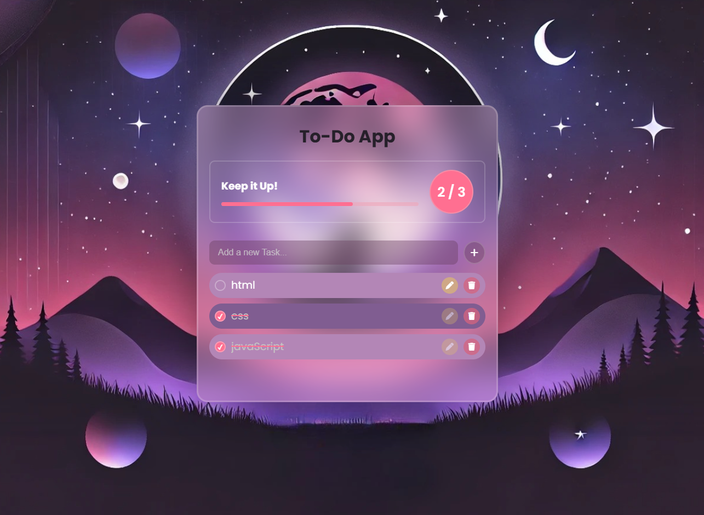

# ✅ Advanced To-Do App  

A feature-rich **To-Do App** built with **HTML, CSS, and JavaScript**. This app allows users to manage their tasks efficiently with advanced features like task categorization, due dates, local storage support, and more.  

## 🎨 Features  

✅ **Add, Edit, and Delete Tasks** – Manage your to-do list with ease  
✅ **Mark Tasks as Completed** – Track progress efficiently  
✅ **Task Progress Bar** – Visualize how many tasks are completed  
✅ **Task Completion Animations** – Smooth fade-out or checkmark animation when completing tasks   
✅ **Local Storage Support** – Saves tasks even after page refresh  
✅ **Responsive Design** – Works on all devices  

## 🖥️ Technologies Used  

- **HTML5** – For structuring the web page  
- **CSS3** – For styling and responsive design  
- **JavaScript (ES6+)** – For task management and local storage  

## 🚀 Live Demo  

[Live Demo Here](https://ahmedragab15.github.io/Advanced-ToDo-App)  

## 📸 Preview  

  
  
